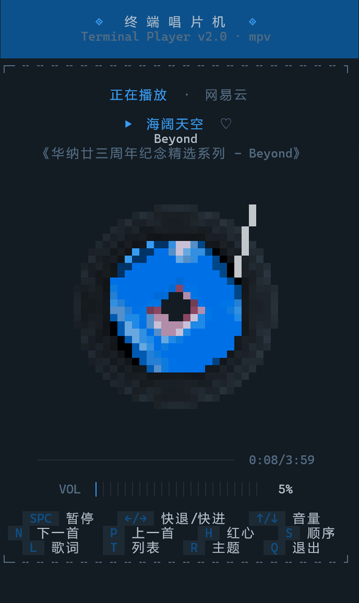
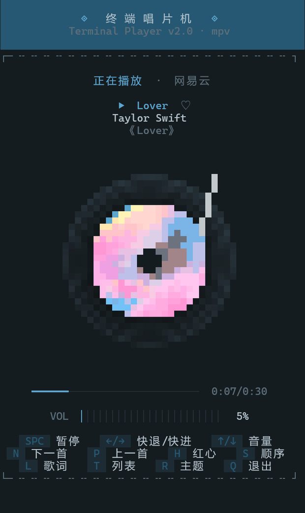
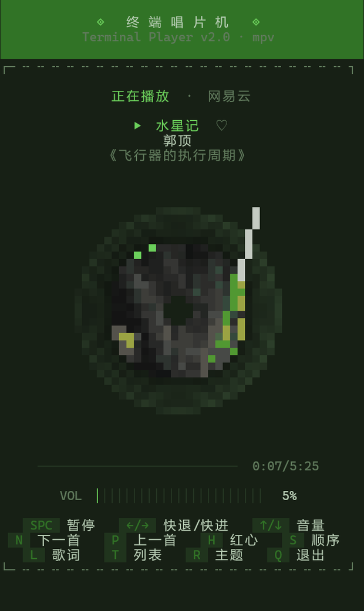
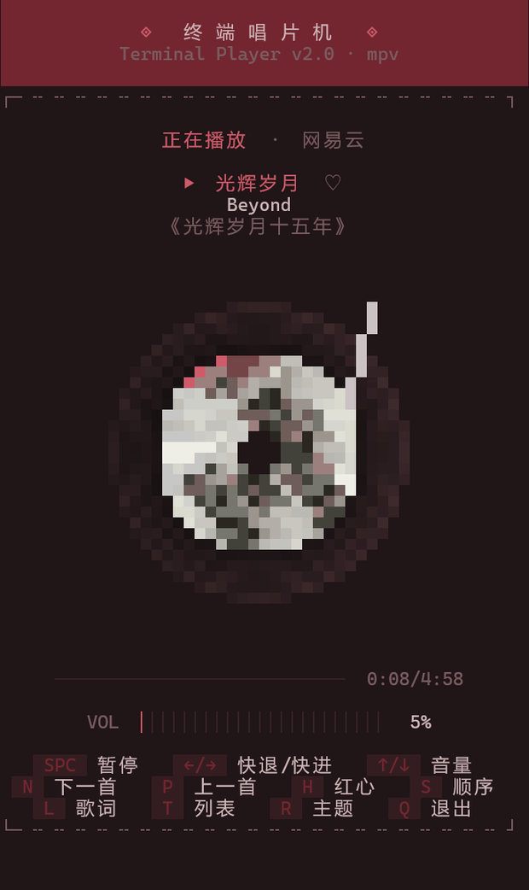
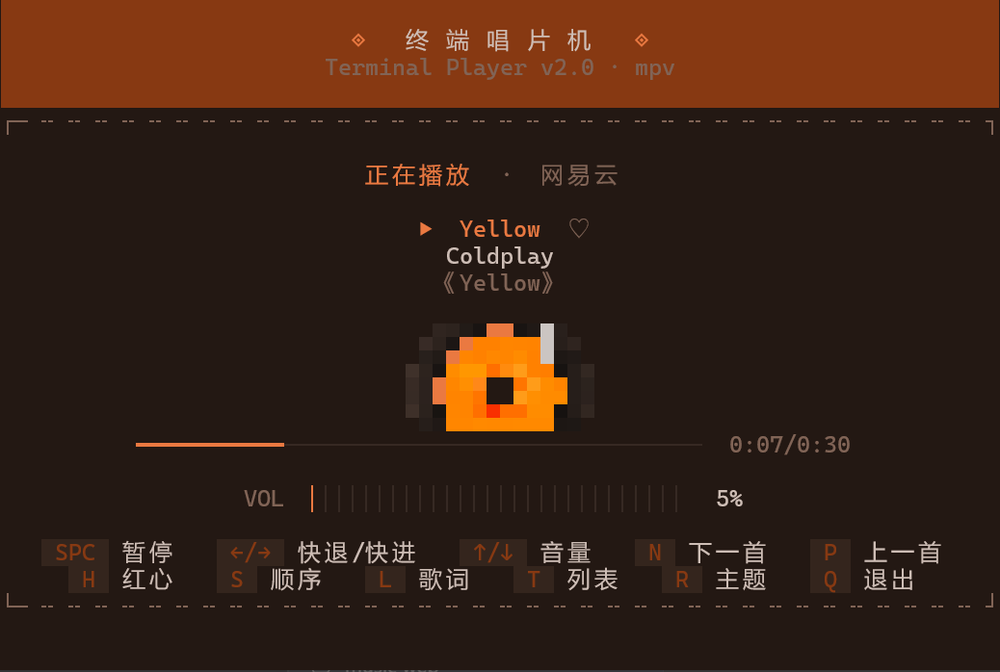
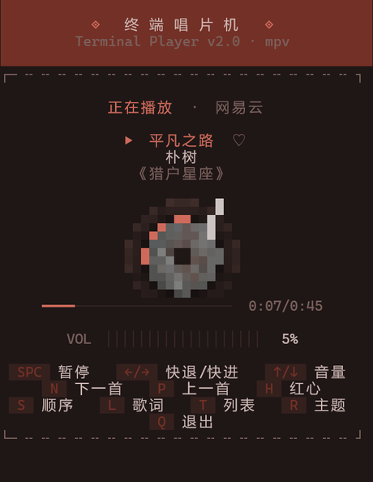
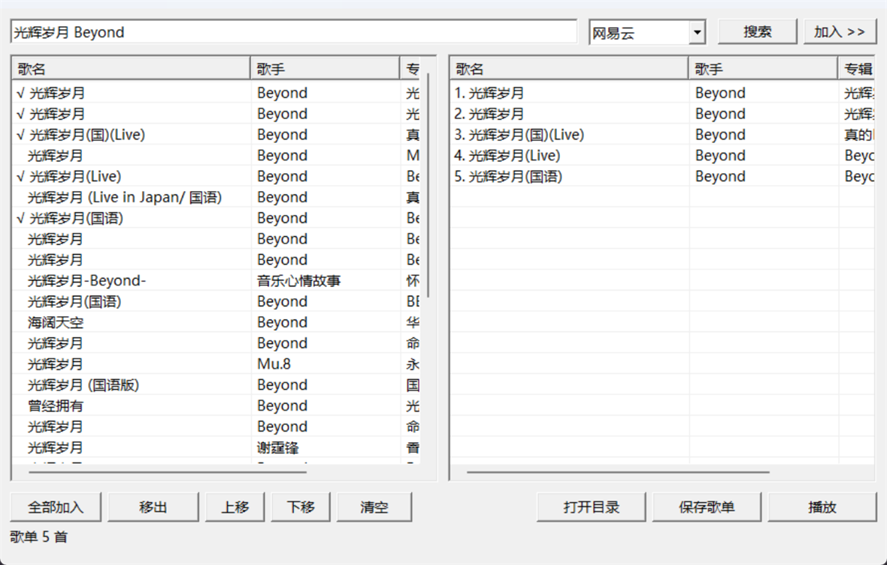

# musiccil

终端里的黑胶唱片机。封面缩成像素画放在唱片中心，跟着盘一起转；配色从当前封面里取，
换歌时整屏渐变过去。声音交给 mpv，真出声。

默认窗口是竖屏 70×56 字符，约 780×1240 像素，高宽比接近手机：


换一首歌就换一套配色：

| | | | |
|---|---|---|---|
|  |  |  |  |

尺寸也能改。横过来是 `--window-size 100x30`：



缩到 46×40 还能用，按键提示会自动折行：



歌词页和播放列表：

| 歌词 | 列表 |
|---|---|
|  |  |

另有一个 Windows 图形界面，搜歌和攒歌单用：



界面全部画在终端里。没有网页，没有 Electron。

## 接口与密钥

曲库数据从 musiccil API 调用站取，调用要带密钥：

```
GET https://muscil.geekdom.top/open/music/url?key=你的密钥&id=4875127&type=wy
```

站点校验密钥、扣一次配额，然后把数据返回。密钥在站点上免费领：注册账号后自动生成一把，
在控制台里复制出来，再用 `musiccil --setup` 存到本地。站点上还有这些：

- 邮箱验证码注册、登录、改密码
- 每个账号最多 10 把密钥，可以重置、停用
- 配额按次算，新账号有初始配额，每天第一次调用再补一份，不够了可以用签到和兑换码
- 控制台里能看到剩余配额、今日和近 14 天用量、按接口的分布、最近的调用明细

取数失败会把这一次的配额退回来。校验密钥的 `/api/key-info` 不扣配额。

| 你的情况 | 怎么做 |
|---|---|
| 只想听歌 | 去 [muscil.geekdom.top](https://muscil.geekdom.top) 注册领密钥，剩下的都在播放器里 |
| 想换接口地址 | `set MUSICCIL_API_BASE=https://你的地址/open/music/` |

## 命令行还是图形界面

两个入口，共用同一个播放内核：

| 入口 | 适合 |
|---|---|
| 命令行 `musiccil` | 直接听某首歌、要一份推荐歌单，或者交给脚本和 AI 去调 |
| 图形界面 `gui/` 里的 exe | 慢慢搜、慢慢挑，手动攒好歌单再开播 |

图形界面不负责播放。点「播放」时它先把歌单存下来，再交给终端播放器开唱。

## 安装

要三样东西：Python 3.9 以上、[mpv](https://mpv.io/)（真正负责出声的那个）、Pillow。

```bash
pip install -e .
```

mpv 会自己去 PATH 和几个常见安装位置找。装在别处的话指一下：

```bash
set MUSICCIL_MPV=D:\tools\mpv\mpv.exe
```

### 配密钥

没有密钥搜不了歌，这一步跳不过去。仓库里也不带密钥。

去 <https://muscil.geekdom.top> 注册一个账号，登录后在「控制台 → 我的密钥」里复制自己的密钥。
第一次用播放器时它会问你：

```bat
musiccil --setup
```

把密钥粘进去回车。它会校验一次（不扣配额），过了就存到 `%USERPROFILE%\.musiccil\key`，
以后所有命令自动用它。也可以临时指定：

```bat
musiccil --setup --key 你的密钥      # 不交互，Agent 可以代你存
musiccil --key 你的密钥 "稻香"        # 只这一次，不落盘
set MUSICCIL_API_KEY=你的密钥        # 只在当前窗口有效
```

没配的时候它不会闷声失败，会直接把上面这几条打出来告诉你怎么办。想知道还剩多少配额，
去站点的「控制台 → 用量统计」看。

## 用法

这些都能直接喂给它：歌名、`平台:ID`、本地文件、目录、m3u、音频直链、歌单、排行榜、JSON 歌单。

```bash
musiccil "加州梦游" -l 5                # 搜索并依次播放
musiccil qq:001I6gzS3LufWy              # 平台:歌曲ID
musiccil "D:\Music\夜曲.flac"           # 本地文件
musiccil "D:\Music"                     # 整个目录
musiccil --list 149553                  # 网易云歌单
musiccil --toplist 3778678              # 排行榜
musiccil --user 123456 --pick 0         # 某用户收藏的第 1 个歌单
musiccil --file night.json              # 播放 JSON 歌单
musiccil "关键词" --search --json-out   # 只搜索，输出 JSON
```

### 搜索到播放一次做完

`--book` 和 `--mix` 把「搜歌 → 挑歌 → 取音频、封面、歌词 → 开窗播放」放在一次命令里做完：

```bash
musiccil "A Rusty Dream" --artist DOUDOU --book song.json          # 指定歌曲
musiccil --mix mix.json "深夜 city pop 氛围" --mix-count 8          # 推荐歌单
musiccil --mix mix.json "DOUDOU 独立民谣" --seed "A Rusty Dream" --artist DOUDOU
                                                                   # 想听某首 + 再推荐几首
```

`--mix` 会去掉重复、跳过 live/remix/伴奏版、限制同一歌手的数量，凑不满就自动翻页。
音频、封面和歌词是并发取的，10 首大概 0.3 秒。`--seed` 指定的那首排第一，其余自动补。

`musiccil` 这个命令的脚本目录经常不在 PATH 里（Windows 上尤其常见），
那就一律写成 `python -m musiccil ...`，装好之后在任何目录都能这样用。

### 按键

`SPC` 播放/暂停 · `←/→` 快退快进 5s · `↑/↓` 音量 · `M` 静音 ·
`N/P` 上/下一首 · `H` 红心 · `S` 播放模式 · `L` 歌词 · `T` 列表 · `R` 主题 · `Q` 退出

### 换曲的过渡

换歌时配色和封面在 0.9 秒内渐变过去，不会硬切。切歌和快进快退另有 0.22 秒的音频
淡入淡出，声音不会突然断掉。这几个时长都能改：

```bash
musiccil --theme-fade 1.6 "稻香"   # 配色/封面过渡，0 = 不过渡
musiccil --audio-fade 0.5 "稻香"   # 音频淡入淡出，0 = 直接切
musiccil --spin 8 "稻香"           # 唱片转速（度/秒），默认 15 约 24 秒一圈
```

## 图形界面（C++ / Win32）

原生 Windows 窗口程序，用 MinGW 一条命令就能编译，不需要 Qt、wxWidgets 或 CMake。

```bat
cd gui
build.bat                          :: 产出 gui\build\musiccil-gui.exe
build\musiccil-gui.exe
```

- 搜索框填关键词，选平台（网易云/QQ/酷狗/酷我/咪咕/千千），回车就搜。
  已经加进歌单的条目会打勾，省得重复添加。
- 双击加一首，也可以「全部加入」；右边能移出、上移、下移、清空。
- 点「播放」会先存歌单，然后在独立终端窗口里拉起播放器。
- 歌单落在 `%LOCALAPPDATA%\musiccil-gui\playlist.json`，可以直接 `musiccil --file` 复用。

细节与实现坑见 [gui/README.md](gui/README.md)。

## 在 AI Agent 里用（Skill）

仓库里带了技能包 `skills/musiccil/`，装上之后 AI 就能一条龙做完
「推荐歌 → 取音频封面歌词 → 交给播放器」：

```bash
cp -r skills/musiccil ~/.codex/skills/musiccil
```

写这个技能包的时候踩到两件事，所以里面写死了两条规矩：

- 一次工具调用跑完全程。拆成「搜一次 → 读结果 → 写歌单 → 再解析 → 再播放」的话，
  实测要 5 分钟，而这些命令本身只要 1 秒，时间全花在来回上。`--book` 和 `--mix`
  就是为这个加的。
- 播放器要开成独立窗口。它是交互式界面，在 agent 会话里直接跑会进管道，用户什么也
  看不到。播放器发现输出不是终端时会自己开窗，直接调就行。

| 用户说 | AI 执行 |
|---|---|
| "我想听 DOUDOU 的 A Rusty Dream" | `musiccil "A Rusty Dream" --artist DOUDOU --book %TEMP%\s.json` |
| "放点深夜 city pop" | `musiccil --mix %TEMP%\m.json "深夜 city pop 氛围" --mix-count 8` |
| "想听 X，再推荐几首" | `musiccil --mix %TEMP%\m.json "DOUDOU 独立民谣" --seed "X" --artist DOUDOU` |

技能一开头会先确认密钥。没有的话它会引导用户去 <https://muscil.geekdom.top> 领一把，
再用 `musiccil --setup --key <密钥>` 存下来（AI 可以代劳）。

接口字段、平台差异与已知坑：`skills/musiccil/references/api.md`、`references/cli.md`。

## 独立使用说明

不打算碰 AI、只想当普通播放器用，看 [docs/standalone.md](docs/standalone.md)。
装什么、怎么配密钥、五种常用听法、按键表、歌单格式、常见问题都在那一份里。

## 独立窗口运行

播放器是交互式界面，得有个真终端才画得出来。标准输出被管道接走，或者虽然连着终端但窗口
是隐藏的（agent 的 PTY 就长这样），它就判断自己「看不见用户」，于是新建一个终端窗口跑起来，
当前命令立刻返回，顺手打印窗口 pid 和按键提示。窗口标题跟着当前曲目变。

```bash
musiccil "深夜 city pop" -l 10     # 在终端里就地播放；在管道/agent 里自动开窗
musiccil --file night.json         # 同上
musiccil --window ...              # 强制开新窗口
musiccil --no-window ...           # 强制就地运行（输出必须是真终端）
musiccil --window-size 100x30 ...  # 自定义窗口尺寸（默认竖屏 70x56）
```

窗口默认竖屏 70×56（约 780×1240 像素），唱片占屏高三分之一左右。Windows 上优先用
`wt --size` 开窗，这样窗口本身就是竖的；没有 Windows Terminal 就退回新建控制台，
由播放器自己调尺寸。

别对播放器做输出重定向（`> log`、`| tee` 这类）。Windows 上新控制台的 tty 只有在
stdout 不被重定向时才成立，重定向之后窗口里就画不出界面了。

## 系统媒体控制（Windows）

播放时曲目会进系统媒体通知：任务栏的媒体面板能看到曲名、歌手、专辑、封面和进度，
键盘上的播放/暂停、上一首/下一首也直接管用。默认开着，`--no-media-controls` 关掉。
这块依赖 winsdk（`pip install -e ".[media]"`），不装也能听，只是没有系统媒体控制。

## 几个实现上的选择

这一节记的是几个不那么显然的决定，和当初为什么这么写。要改代码的话先看两眼。

界面的颜色来自当前封面。做法是把封面的颜色量化，再按饱和度、明度和占比挑一个主色出来，
顺着它推导背景、顶栏、强调色、按钮底色和黑胶凹槽色。推导时会守着几条底线：底色要够暗、
文字要读得清、顶栏得看得出来。

换歌时新配色不直接套上去：整屏一起换会「啪」地跳一下，所以改成 0.9 秒插值过渡。
鲜艳的颜色按 HSV 的最短色相弧旋转——蓝变红走紫色那边，中途不会掉饱和度；深色背景则走
RGB 直插，否则中途会泛出奇怪的彩色。进度用 smoothstep 缓入缓出。封面像素画也一起交叉
淡入，上一首和这一首的网格按同一个进度插值；新曲没有封面就淡出成主题色，而不是突然空掉。
过渡帧量化到 24 档并缓存，不然每帧都重新生成网格会把旋转缓存全部冲掉。

像素封面用一个半 block（`▀`）来画，一个字符刚好对应封面上的一个像素。封面先缩到约
20×20 再放进唱片区，按最近邻旋转，角度缓存有限的几档。缩小这一步用 BOX 重采样加约 22 色
量化、关掉抖动，边缘硬、色块干净，比 LANCZOS 清楚不少。黑胶外圈的高光用 `sin(ang + ...)`
来算，一圈只扫过一次，和中心封面同一个转速；这里如果写成 `sin(2*ang)` 就会出现两个对称
高光，看着像外圈在以两倍速转。转速默认 15 度/秒（24 秒一圈），`--spin` 可以改。角度分了
720 档、按 0.5 度量化缓存；一开始量化到 1 度，30fps 下每帧只推进 0.5 度，有一半的帧原地
不动，慢速下看着一顿一顿的。

切歌的音频过渡用的是 mpv 的 `volume-gain`（一层独立的增益，单位 dB）：淡出、切换、淡入。
这样不碰用户设的音量，界面上那根音量条也不会跟着抖。整个过渡不能卡住界面，所以按下之后
先静音，主循环按帧往前推，淡出走完才真正切。连着按下一首时，逻辑位置立刻更新，只把
「加载音频」这一步往后推——否则第二次会算出同一个目标，按两下才走一首。

退出时得连 mpv 一起收掉。正常退出走 `quit()` 没问题，但用户直接关窗口、或者在任务管理器
里结束进程时，清理代码根本不会执行，mpv 就变成孤儿继续放歌。为此把 mpv 挂进一个设了
`KILL_ON_JOB_CLOSE` 的 Windows Job Object：句柄随着进程结束由内核关闭，系统就会顺手把它收掉。

系统媒体控制借的是 winsdk 里 `MediaPlayer` 的 SMTC 通道，用来发布曲名、歌手、专辑、封面
和进度，也用来接收系统媒体键。这里有三个坑：按键回调靠 Windows 消息队列派发，主循环必须
周期性泵消息；回调参数是 WinRT 枚举对象，得读 `.name`（`str()` 只会给出 `"0"` 这种数字）；
还得让 mpv 关掉它自带的媒体会话，不然两个会话会抢媒体键。

界面的输出行数和宽度始终等于终端尺寸，否则终端会滚动或者错位；中英日韩混排按
East Asian Width 算列宽。播放和绘制是分开的：mpv 在后台通过命名管道 IPC 收指令，
界面只读状态、自己画，所以换歌、跳转、调音量都不会把界面卡住。

## 测试

```bash
python -m unittest discover -s tests -t .
```

## 已知限制

- 版权限制会让一部分曲目取不到音频直链，QQ、酷我、千千比较明显。播放器会自动跳过，
  并在启动时提示。想稳一点就优先用网易云（`wy`）或酷狗（`kg`）。
- 返回的音频和封面地址带时效，不适合长期缓存，隔一段时间要重新取。
- 关键词里词一多，接口容易直接回「获取失败」。播放器会自动逐级丢词重试。
- 终端得支持真彩色（24-bit）。Windows Terminal、iTerm2、现在常见的 Linux 终端都行。
