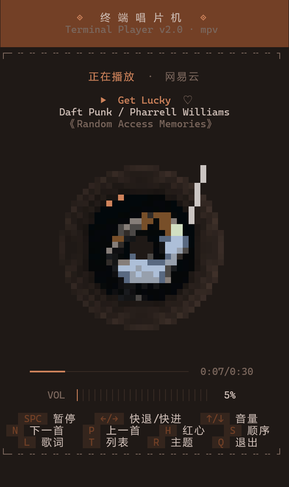
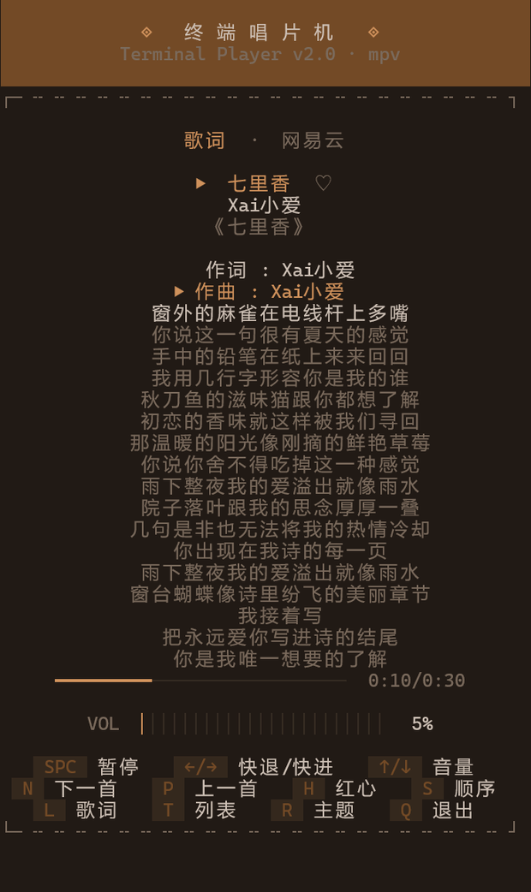
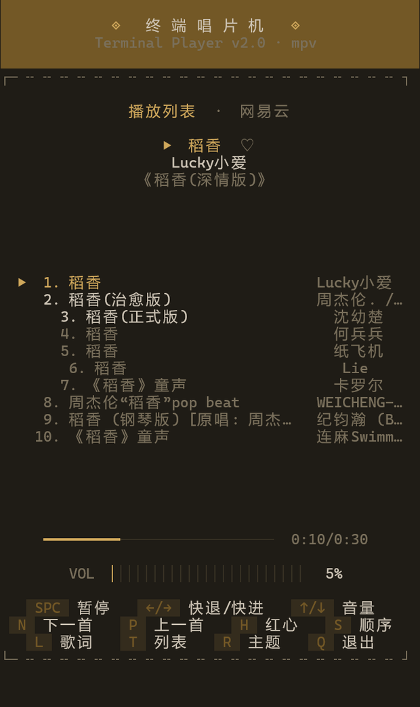

# 单独使用播放器

这份文档讲的是不碰 AI、不写脚本，就把它当普通播放器用。
想让 AI 替你放歌，看仓库根目录 README 里的「在 AI Agent 里用」一节。



---

## 1. 装一次

要三样：Python 3.9 以上、[mpv](https://mpv.io/)（真正出声的那个）、Pillow（用来处理封面）。

```bat
pip install -e .
```

mpv 会自己去 PATH 和几个常见安装位置找。装在别处的话指一下：

```bat
set MUSICCIL_MPV=D:\tools\mpv\mpv.exe
```

### 配密钥

没有密钥搜不了歌，这一步得先做。仓库里不含密钥，去本项目的 musiccil API 调用站免费领：

1. 打开 <https://muscil.geekdom.top>，用邮箱注册，会收到验证码。
2. 登录后进「控制台 → 我的密钥」，把密钥复制出来。
3. 回来跑一次：

   ```bat
   musiccil --setup
   ```

   把密钥粘进去回车。它会去校验一次（不扣配额），通过了就存到
   `%USERPROFILE%\.musiccil\key`，以后不用再管。

面板里还能看到剩余配额、今日用量和最近调用。配额不够的时候签到、或者用兑换码补。

不想走引导也行，下面这三条效果一样，挑一条：

```bat
musiccil --setup --key 你的密钥       # 非交互，校验后直接保存
```

```bat
set MUSICCIL_API_KEY=你的密钥         # 只在当前窗口有效
```

```bat
musiccil --key 你的密钥 "稻香"         # 只用这一次，不落盘
```

没配的时候命令不会闷声失败，会直接把上面这几条打出来。

### 接口地址

默认就指向 musiccil API 调用站 `https://muscil.geekdom.top/open/music/`，不用配。
只有想指向别的部署（比如本地调试）时才需要覆盖：

```bat
set MUSICCIL_API_BASE=https://你的地址/open/music/
```

> 密钥是按包量计的，搜索和取详情都会消耗。正常听歌一天用不了多少，
> 但别拿它写那种循环翻页的脚本。

---

## 2. 最常用的五种听法

### 听一首具体的歌

```bat
musiccil "A Rusty Dream" --artist DOUDOU
```

`--artist` 最好带上。不带的话只按歌名取第一条，很容易拿到翻唱或者 remix。带上之后，
当前平台如果没有合格的版本，它会自动换平台去找（周杰伦、陈奕迅这类在网易云经常缺原版，
酷狗和酷我反而有）。

### 让它推荐一批

```bat
musiccil --mix %TEMP%\mix.json "深夜 city pop 氛围" --mix-count 8
```

一次搜索就能凑出一份歌单：自动去重，跳过 live、remix 和伴奏版，同一个歌手最多 2 首，
候选不够会自动翻页。风格描述写得越具体越好。

### 听某首，顺便再来几首

```bat
musiccil --mix %TEMP%\mix.json "DOUDOU 独立民谣" --seed "A Rusty Dream" --artist DOUDOU
```

`--seed` 指定的那首排第一，其余自动补推荐。`--mix-count` 是总数，包含这首种子。

### 播本地的歌

```bat
musiccil "D:\Music\夜曲.flac"
musiccil "D:\Music"
musiccil "D:\Music\list.m3u"
```

依次是单个文件、整个目录、m3u 播放列表。本地文件会读 ID3 标签里的歌名、歌手和专辑，
内嵌封面也能显示出来。

### 播歌单、排行榜、别人的收藏

```bat
musiccil --list 149553
musiccil --toplist 3778678
musiccil --user 123456 --pick 0
musiccil qq:001I6gzS3LufWy
```

依次是歌单、排行榜、某个用户收藏的第一个歌单，以及指定平台上的某一首。

---

## 3. 界面里的按键

键位和常见播放器基本一致：

| 键 | 作用 | 键 | 作用 |
|---|---|---|---|
| `SPC` | 播放 / 暂停 | `N` / `P` | 下一首 / 上一首 |
| `←` / `→` | 快退 / 快进 5 秒 | `↑` / `↓` | 音量 ±5 |
| `L` | 歌词页 | `T` | 播放列表页 |
| `S` | 播放模式（顺序/随机/单曲） | `H` | 红心 |
| `R` | 换配色主题 | `M` | 静音 |
| `Q` / `Esc` | 退出 | | |

底色跟着当前封面的主色走，换歌时配色和封面都会在 0.9 秒内渐变过去，不会硬切。

歌词页和播放列表：

| 歌词页 | 播放列表 |
|---|---|
|  |  |

### 系统媒体控制（Windows）

播放时曲目会出现在任务栏的媒体面板里，曲名、歌手、专辑、封面、进度都有，
键盘上的播放暂停键和上一首/下一首键也能直接控制它。不想要就加 `--no-media-controls`。
这块依赖 `winsdk`，没装不影响播放。

---

## 4. 想让窗口长得不一样

```bat
 musiccil --window-size 100x30 "稻香"
musiccil --spin 8 "稻香"
musiccil --theme-fade 1.6 "稻香"
musiccil --audio-fade 0.5 "稻香"
musiccil --volume 60 "稻香"
```

依次是：窗口的字符尺寸（默认竖屏 70x56）、唱片转速（度/秒，默认 15，约 24 秒一圈）、
换曲的配色过渡（默认 0.9 秒，0 就是不过渡）、切歌时的音频淡入淡出（默认 0.22 秒，
0 就是直接切）、初始音量。

### 关于「独立窗口」

播放器得有个真终端才画得出界面。它自己会判断：

- 你在终端里直接跑，就地显示，不额外开窗。
- 从脚本、管道、双击或者 AI 会话里跑，它自己新建一个终端窗口，当前命令立刻返回。
- 想自己指定：`--window` 一定开新窗，`--no-window` 一定就地跑。

命令行里出现「已在独立窗口打开播放器（pid ...）」就是开成功了。那个窗口关掉，音乐才会停。

> 别对播放器做输出重定向（`> log`、`| tee`）。Windows 上新控制台的 tty 只有在 stdout
> 不被重定向时才成立，重定向之后窗口里就画不出界面。

---

## 5. 歌单文件

歌单就是普通 JSON，可以手写、可以改、可以一直留着：

```json
[
  {"id": "3422762511", "type": "wy", "name": "A Rusty Dream", "artist": "DOUDOU"},
  {"id": "1474392057", "type": "wy", "name": "加州梦游", "artist": "闫泽欢"}
]
```

- 定位一首歌靠 `id` 加 `type` 就够了（`wy` 网易云 / `qq` / `kg` 酷狗 / `kw` 酷我 / `mg` / `qi`）。
  `name` 和 `artist` 只是给界面显示的。
- 本地文件写成 `{"url": "D:/Music/a.flac", "type": ""}`。
- 播放：`musiccil --file mysongs.json`。
- 生成：`--playlist-out mysongs.json`（搜索后落盘），或 `--no-play` 配合 `--book` / `--mix`。

音频直链是 CDN 的临时地址，会过期，所以歌单里不用存，播放器每次会重新解析。

---

## 6. 常见问题

**提示没有接口密钥**

最常见的一次性问题，按上面「配密钥」走一遍就好。已经有密钥了就直接
`musiccil --setup` 粘进去。想确认这把钥匙还能用多少次，去调用站
「控制台 → 用量统计」看。

**有窗口但没声音**

多半是这首取不到音频直链，版权限制。界面照开，就是不出声。换个平台试试：
`musiccil -p kg "歌名"`。

**找不到 mpv**

`set MUSICCIL_MPV=<mpv.exe 的完整路径>`。

**中文乱码、界面花掉**

终端得支持真彩色（24-bit）和 UTF-8。Windows Terminal、iTerm2 都行，
老的 cmd 窗口建议直接换成 Windows Terminal。

**关掉终端窗口后还有声音**

正常退出（按 `Q`）和直接关窗口都会连带结束 mpv。真有残留就去任务管理器结束 `mpv.exe`。

**搜索报「获取失败」**

关键词里词一多，接口就容易这样。播放器会自动逐级丢词重试；还是不行就换个更短的关键词，
或者换个平台。

---

## 7. 它到底是什么

一句话：用 mpv 放音频，界面自己画的终端播放器。

- 配色从当前封面里提主色，再推导出整套界面的颜色，包括背景、顶栏、强调色和黑胶凹槽色。
- 封面缩成约 20x20 的像素画，一个字符就是一个像素，放在唱片中心跟着一起转。
- 外圈高光一圈只扫过一次，和内圈封面同一个转速，看上去才是一整张唱片在转。
- 播放和绘制是分开的：mpv 在后台通过命名管道收指令，界面只读状态自己画，
  所以换歌、跳转、调音量都不会把界面卡住。

播本地文件完全不依赖接口，断网也能用（`--offline` 时只用本地缓存的封面）。
